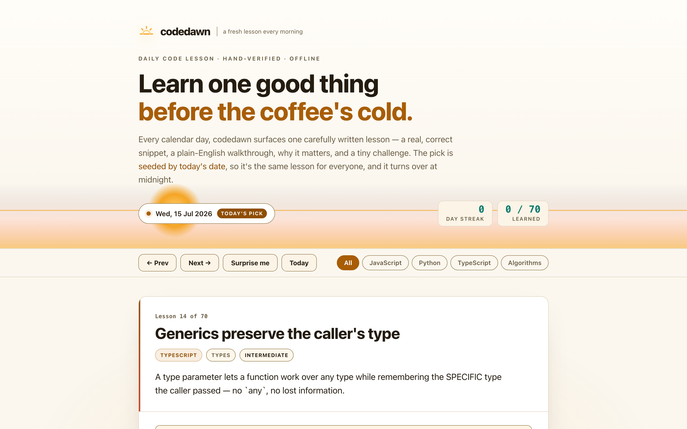

# codedawn

**A fresh code lesson every morning.** codedawn surfaces one carefully written, hand-verified coding lesson each calendar day — a real, correct snippet, a plain-English walkthrough, a note on why it matters, and a tiny challenge with a revealable answer. The pick is *seeded by today's date*, so it's the same lesson for everyone and it turns over at midnight. 100% client-side, zero dependencies, works fully offline.

## Why

Most "learn to code" feeds are either an endless firehose or a paywalled drip. codedawn is deliberately small and calm: **one good thing a day**. The corpus is 70 hand-authored lessons spanning JavaScript, Python, TypeScript, and language-agnostic algorithms and gotchas — each with a snippet that was actually run and checked, not generated on the fly.

Because the day's lesson is chosen deterministically from the date, it feels like a genuine "lesson of the day": at 5am it's already today's, everyone sees the same one, and tomorrow brings a new one. You can also browse the whole corpus, filter by language, or hit *Surprise me*.

## Features

- **Lesson of the day** — a date-seeded deterministic pick chooses today's lesson. Same calendar day → same lesson, everywhere, changing at local midnight.
- **A curated, correct corpus** — 70 hand-written lessons across JavaScript, Python, TypeScript, and algorithms; every code snippet was verified by hand.
- **Structured teaching** — each lesson has a one-idea concept, the code, a numbered walkthrough keyed to that code, a "why it matters", and a challenge whose answer you can reveal.
- **Streak + progress** — a local day-streak and a "learned N / 70" tracker, kept only in your browser's local storage. Mark a lesson as learned to advance your streak.
- **Browse & filter** — previous / next (and arrow keys), a *Surprise me* random pick, and language filters (JS / Python / TypeScript / Algorithms).
- **Hand-rolled syntax highlighting** — a tiny tokeniser colours the code with no external library.
- **100% offline** — no accounts, no network calls, no tracking. Everything runs in your browser.

## Quickstart

Just open `index.html` in any modern browser — no build step, no server, no install.

- **Local:** double-click `index.html`, or run a static server in the folder.
- **Hosted:** **[Open codedawn live](https://sreenivas-sadhu-prabhakara.github.io/codedawn/)**

Your streak and learned-lessons set are saved in your browser's local storage, so they persist between visits on the same device.

## How today's lesson is chosen

Your device's calendar date (`YYYYMMDD`) seeds a small, self-contained pseudo-random generator (`mulberry32`). That produces one stable index into the corpus. The same date always yields the same lesson, and because it depends only on the local date, it rolls over at your local midnight. There is no server and no coordination — the determinism is entirely in the arithmetic.

## Privacy

codedawn is built to be trustworthy: it simply cannot phone home.

- A strict Content-Security-Policy sets `connect-src 'none'`: the app **cannot** make any network request even if it tried.
- No external fonts, scripts, images, or analytics. Everything is self-contained; the only inline scripts are the JSON-LD structured-data blocks (data, not behaviour).
- All logic runs in your browser. Your streak and progress never leave your device.
- Because there are no network dependencies, it keeps working with no connection at all — download it once and it runs offline.

## Honesty note

codedawn **does not call an AI and does not generate code on the fly.** It deterministically *selects* and presents one lesson from a fixed, hand-authored corpus. There is no model, no API, and no live generation. Every snippet was written and verified by hand — but it is still educational material, not professional advice, and you should test any code in your own environment before relying on it. The corpus is finite (70 lessons), so over a long enough span the daily pick will eventually repeat.

## Disclaimer

codedawn provides educational programming content for general learning purposes only. It is not professional engineering, security, or other advice, and the code snippets — while hand-verified — may not fit your specific situation, language version, or runtime. Always test code in your own environment. This software is provided under the MIT License, "as is", without warranty of any kind; the author accepts no liability for any loss or damage arising from its use.

## License

[MIT](./LICENSE) © 2026 Sreenivas Sadhu Prabhakara
